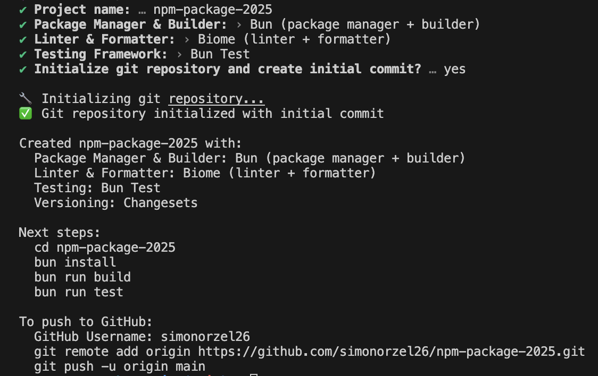
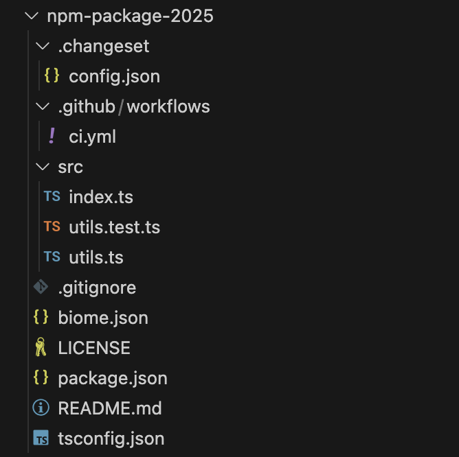

# init-npm-pkg

Instantly create a fully configured npm package with GitHub Actions, testing, and modern tooling. Follows Matt Pocock's latest best practices for npm packages.

## Usage

```bash
npx init-npm-pkg
```

## CLI Output



## Generated Structure



## What You Get

- **Bun or npm** - Choose your package manager
- **Biome or ESLint** - Modern linting and formatting
- **Vitest or Bun Test** - Fast testing frameworks
- **GitHub Actions** - Automated CI/CD
- **Changesets** - Semantic versioning
- **TypeScript** - Full type safety
- **Git setup** - Optional repository initialization

## Options

| Setting | Options |
|---------|---------|
| Package Manager | Bun, npm |
| Linter | Biome, ESLint + Prettier |
| Testing | Vitest, Bun Test, None |
| Git | Initialize repository (optional) |

## License

MIT
